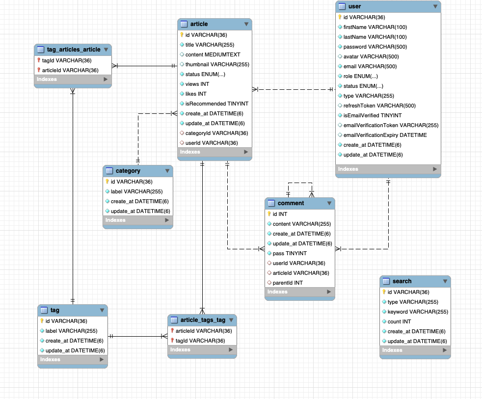

# walking-distance

#### 목차
1. [배포 및 도메인 정보](#1-배포-및-도메인-정보)
2. [프로젝트 협업 구조](#2-프로젝트-협업-구조)
3. [서버 아키텍쳐](#3-서버-아키텍쳐)
4. [프로젝트 소개](#4-프로젝트-소개)
5. [어플리케이션 로컬 환경 실행](#5-어플리케이션-로컬-환경-실행)
6. [API 명세서](#6-api-명세서)
7. [데이터베이스 구조](#7-데이터베이스-구조)
8. [배포](#8-배포)
9. [CI / CD 파이프라인](#9-ci--cd-파이프라인)

<hr/>

### 1. 배포 및 도메인 정보
- **백엔드 배포상태** : [백엔드 링크](https://walkdi.com/api-docs)
- **프론트 배포상태** : [프론트엔드 링크](https://walkdi.vercel.app)
- **도메인**: 어플리케이션은 HTTPS 구성된 사용자 정의 도메인을 사용하고 있습니다.
<hr/>

### 2. 프로젝트 협업 구조
- 프로젝트는 백엔드와 프론트엔드로 나누어져 개발되고 있습니다. 
- 이는 백엔드와 프론트엔드가 독립적으로 개발되며, 각각의 역할과 책임을 가지고 협업하고 있음을 의미합니다.
    <br/>
    > **1. 백엔드 (Backend)**
    - 백엔드 개발은 [김민지](https://github.com/minjispace)에 의해 담당되었습니다.
    - 백엔드는 NestJS와 TypeORM MySQL 데이터베이스를 사용하여 구축되었습니다.
    - API 엔드포인트 및 로직은 [백엔드 GitHub 저장소 링크](https://github.com/everydaycono/walking-distance/tree/main/server)에서 확인할 수 있습니다.
    - 백엔드는 서버의 핵심 기능 및 데이터 처리를 담당하며, 프론트엔드에서 필요한 데이터를 제공합니다.
    - API 문서는 [API 문서 링크](https://walkdi.com/api-docs)에서 확인 가능하며, 프론트엔드 개발자가 이를 활용하여 프론트엔드 구현을 진행하였습니다.
    <br/>

    > **2. 프론트엔드 (Frontend)**
    - 프론트엔드 개발은 [이준현](https://github.com/everydaycono)에 의해 담당되었습니다.
    - 프론트엔드는 Nest.js를 사용하여 개발되고 있습니다.
    - 프론트엔드 개발자는 백엔드 API와 상호 작용하고 사용자 인터페이스를 개발하며, 백엔드에서 제공하는 데이터를 시각적으로 표현합니다.
    - 프론트엔드 개발에 대한 자세한 정보는 [프론트엔드 GitHub 저장소 링크](https://github.com/everydaycono/walking-distance/tree/main/client)에서 확인할 수 있습니다.
    <br/>

    > **3. 프로젝트 관리**
    - 프로젝트 관리를 위해 [GitHub Projects](https://github.com/users/everydaycono/projects/1)를 사용하고 있습니다. 
    - 이를 통해 작업 항목 및- 프로젝트 진행 상황을 시각적으로 추적하고 있습니다.
    - 티켓(이슈)를 사용하여 새로운 기능 개발, 버그 수정, 작업 등의 작업 항목을 작성하고 관리합니다.
    - 작업 항목은 GitHub Projects의 다양한 열(칸반 보드)에 배치하여 작업이 진행되는 상태를 실시간으로 확인합니다.

    > **4. PR 및 협업**
    - 새로운 기능 추가 또는 버그 수정과 관련된 작업은 개별 브랜치에서 수행됩니다.
    - [PR](https://github.com/everydaycono/walking-distance/pulls?q=is%3Apr+is%3Aclosed)을 통해 개별 브랜치에서 메인 브랜치로 변경 사항을 병합합니다.
    - 코드 리뷰 및 토론은 PR에서 이루어지며, 변경 사항에 대한 의견 및 피드백이 공유됩니다.
    - 변경 사항이 승인되면 해당 PR이 메인 브랜치로 병합되고, 해당 작업 항목에 대한 티켓이 닫힙니다.

    <br/>

- 이러한 협업 프로세스와 의사 소통 방법을 명시하면서 프로젝트의 협업 환경을 이해하고 개발자 간의 원활한 협업을 촉진할 수 있었습니다.
        
<hr/>   

### 3. 서버 아키텍쳐
- WalkDi의 백엔드는 NestJS를 사용하여 구축되었습니다.
- Planet Scale에서 호스팅되는 MySQL 데이터베이스를 활용합니다. 
- WalkDi의 데이터베이스는 Planet Scale에서 호스팅되며, 다양한 Entity에 따라 스키마가 구성됩니다. 
스키마는 테이블, 컬럼 및 관계를 정의하고, 데이터의 구조를 관리합니다.
- 아래는 주요 컴포넌트와 모듈 구성입니다.
    <br/>
    > **1. User Module**
    - User Module : 사용자 관리를 담당하는 모듈입니다.
    - User Entity : 사용자 정보를 나타내는 Entity로, 데이터베이스의 사용자 테이블과  연결됩니다.
    - User Controller : 사용자와 관련된 요청을 처리하는 컨트롤러입니다.
    - User Service : 사용자 정보를 조회, 생성, 수정 및 삭제하는 로직을 처리하는 서비스입니다.    
    - User DTO : 사용자 데이터 전송 객체로, 클라이언트와 서버 간 데이터 교환에 사용됩니다.
     <br/>

    > **2. Auth Module**
    - Auth Module : 인증과 관련된 모듈입니다.
    - Auth Decorators : 인증 관련 데코레이터로, 엑세스 토큰, 리프레시 토큰, 역할(Role)등을 관리합니다.
    - Auth Guards : 인증된 사용자의 엔드포인트 액세스를 제어하는 가드로, 역할(Role) 및권한에 따른 액세스 제한이 가능합니다.
    - Auth Strategies : 인증 전략으로, GitHub 로그인과 같은 다양한 로그인 전략을 구현합니다.
    - Auth Controller : 인증 관련 요청을 처리하는 컨트롤러입니다.
    - Auth Service : 사용자 로그인, 회원가입 및 인증에 관한 비즈니스 로직을 처리합니다.
      <br/>

    > **3. Article Module**
    - Article Module : 기사 관리를 담당하는 모듈입니다.
    - Article Entity : 기사 정보를 나타내는 Entity로, 데이터베이스의 기사 테이블과 연결됩니다.
    - Article Controller : 기사와 관련된 요청을 처리하는 컨트롤러입니다.
    - Article Service : 기사 생성, 조회, 수정 및 삭제와 관련된 비즈니스 로직을 처리합니다.
    <br/>

    > **4. Category Module**
    - Category Module : 카테고리 관리를 담당하는 모듈입니다.
    - Category Entity : 카테고리 정보를 나타내는 Entity로, 데이터베이스의 카테고리 테이블과 연결됩니다.
    - Category Controller : 카테고리와 관련된 요청을 처리하는 컨트롤러입니다.
    - Category Service : 카테고리 생성, 조회, 수정 및 삭제와 관련된 비즈니스 로직을 처리합니다.
    <br/>

    > **5. Comment Module**
    - Comment Module : 댓글 관리를 담당하는 모듈입니다.
    - Comment Entity : 댓글 정보를 나타내는 Entity로, 데이터베이스의 댓글 테이블과 연결됩니다.
    - Comment Controller : 댓글과 관련된 요청을 처리하는 컨트롤러입니다.
    - Comment Service : 댓글 생성, 조회, 수정 및 삭제와 관련된 비즈니스 로직을 처리합니다.
    <br/>

    > **6. Mail Module**
    - Mail Module : 로그인 및 회원가입과 같은 사용자 인증 프로세스를 위한 메일 서비스를 관리하는 모듈입니다.
    - Mail Service : 이 모듈은 메일 전송 및 관리와 관련된 모든 로직을 처리합니다.
    - Mail Controller : 메일과 관련된 요청을 처리하는 컨트롤러입니다.
    <br/>

    > **7. Search Module**
    - Search Module : 검색 기능을 관리하는 모듈로, 사용자가 기사, 사용자, 댓글 등을 검색할 수 있도록 해줍니다.
    - Search Controller : 검색 요청을 처리하고 적절한 서비스로 라우팅하는 컨트롤러입니다.
    - Search Service : 실제 검색 로직을 처리하는 서비스로, 검색어에 따라 데이터베이스에서 적절한 결과를 검색하고 반환합니다.
    <br/>

    > **8. Tag Module**
    - Tag Module : 기사나 사용자 프로필과 같은 콘텐츠에 태그를 부여하고 관리하는 모듈입니다.
    - Tag Entity : 태그 정보를 나타내는 Entity로, 데이터베이스의 태그 테이블과 연결됩니다.
    - Tag Controller : 태그와 관련된 요청을 처리하는 컨트롤러입니다.
    - Tag Service : 태그 생성, 수정, 삭제, 조회와 관련된 로직을 처리하는 서비스입니다.

### 4. 프로젝트 소개
 > WalkDi는요 !

사용자들에게 더 나은 건강과 삶의 질을 제공하는 혁신적인 플랫폼입니다. 
WalkDi는 다음과 같은 주요 기능을 제공하여 사용자들의 건강과 활동을 증진시키고 소통을 촉진합니다.

1. **로그인 및 회원가입** : 사용자들은 안전하게 로그인하고 회원가입하여 WalkDi의 기능을 활용할 수 있습니다.

2. **나의 Article 작성** : 사용자들은 자신만의 공간에서 다양한 주제로 글을 작성하고 공유할 수 있습니다. 자유로운 글 작성 환경을 제공하여 다양한 이야기를 나눌 수 있습니다.

3. **해시태그 기능** : 게시물에 해시태그를 추가하여 게시물을 카테고리화하고 검색 가능하게 만듭니다. 이를 통해 사용자들은 관심 있는 주제를 쉽게 찾아볼 수 있습니다.

4. **Article 검색 기능** : 키워드를 이용해서 다양한 주제와 정보를 제공하는 게시물을 손쉽게 찾아보는 검색 기능을 제공합니다.

<hr/>

## 5. 어플리케이션 로컬 환경 실행
1. docker 환경을 다운받아 docker로 mysql을 사용하거나 
local mysql을 사용합니다.

2. git clone
    ```
    git clone https://github.com/everydaycono/walking-distance
    ```
3. .env.dev 파일 생성
    ```
    touch .env.dev
    ```
4. .env.dev 파일 구성 예제
    ```
    NODE_ENV=dev
    PORT = 8000

    # JWT ENV  ###########
    JWT_SECRET=JWT_SECRET
    JWT_REFRESH_SECRET=JWT_REFRESH_SECRET

    # APP CONFIG  ###########
    SERVER_API_URL=http://localhost:8000/api
    # APP CONFIG

    ## MAIL ENV START ###########
    SMTP_MAIL_SERVICE_HOST=SMTP_MAIL_SERVICE_HOST
    SMTP_MAIL_SERVICE_USER=SMTP_MAIL_SERVICE_USER
    SMTP_MAIL_SERVICE_PASS=SMTP_MAIL_SERVICE_PASS
    SMTP_MAIL_SERVICE_FROM='"No Reply" <noreply@example.com>'


    # SOCIAL LOGIN ##############
    GITHUB_SOCIAL_LOGIN_CLIENT_ID=
    GITHUB_SOCIAL_LOGIN_SECRET=
    GITHUB_SOCIAL_LOGIN_CALLBACK_URL=


    # ENV FILE #######
    AWS_BUCKET_NAME=AWS_BUCKET_NAME
    ACCESS_ID=ACCESS_ID
    AWS_SECRET_KEY=AWS_SECRET_KEY

    # DB CONFIG
    DB_HOST=localhost
    DB_PORT=3306
    DB_USERNAME=username
    DB_PASSWORD=wdpassword
    DB_NAME=walkdi
    ```
5. docker compose 파일 up 시켜서 mysql 서버 생성해서 연결
    ```
    docker compose up -f docker-compose.dev.yml -d
    ```
6. 서버 시작 시키기
    ```
    yarn & yarn start:dev
            or
    npm i & npm run start:dev
    ```    
<hr/>


## 6. API 명세서

#### 1. **Auth**
[api 명세서 참고 swagger](https://walkdi.com/api-docs)
- **1. create user**
    - End point:
      ```
        POST /api/auth/register
        ```
     - Request 
        ```
         {
            "email": "test@gmail.com",
            "password": "password",
            "firstName": "firstName",
            "lastName": "lastName"
        }
        ```
     - Success Response
        - 201 Created => 유저 성공적으로 생성, 유저 생성했다는 문구 반환
    - Error Response 
        - 400 Bad Request => 요청이 잘못 or 필수 정보 누락 or 유효성 검사 탈락 
        - 409 Conflict Error => 이미 존재하는 유저 에러

        <hr/>
- **2. login user**
    - End point:
      ```
        POST /api/auth/login
        ```
     - Request 
        ```
         {
            "email": "test@gmail.com",
            "password": "password"
        }
        ```
     - Success Response
        - 200 OK 
    - Error Response 
        - 400 Bad Request => 요청이 잘못 or 필수 정보 누락 or 유효성 검사 탈락 
        - 401 Unauthorized Error => username이나 password가 일치하지 않을때
         - 403 Forbidden Error => account가 locked일때 에러
        <hr/>
- **3. social login user**
    - End point:
      ```
        POST /api/auth/social-login
        ```
     - Success Response
        - 200 OK => github login 유저 정보 반환
    - Error Response 
        - 500 Intenal server errror
        <hr/>
#### 2. **User**
- **1. get my all articles**
    - End point:
      ```
        GET /api/user/my/articles
        ```
    - Authorization - JWT accessToken 필요
     - Success Response
        - 200 OK => my articles 데이터 가져오기 성공
    - Error Response 
        - 401 Unauthorized => 인증 권한 실패
        <hr/>
- **2. get other person articles**
    - End point:
      ```
        GET /api/user/{userId}/articles
        ```
    - Authorization - JWT accessToken 필요
    - required parameter - userId 필요
     - Success Response
        - 200 OK => other person's articles 데이터 가져오기 성공
    - Error Response 
        - 401 Unauthorized => 인증 권한 실패
        <hr/>
#### 3. **Article**
- **1. create article**
    - End point:
      ```
        POST /api/article
        ```
    - Authorization - JWT accessToken 필요
     - Success Response
        - 201 CREATED => article 생성 성공
    - Error Response 
        - 401 Unauthorized => 권한 인증 실패
        - 400 Bad Request => 필수 입력 목록 실패
        <br/>
- **2. get other person articles**
    - End point:
      ```
        GET /api/article
        ```
    - required parameter - userId 필요
     - Success Response
        - 200 OK => other person's articles 데이터 가져오기 성공
    - Error Response 
        - 400 Bad Request => status에 따른 결과값이 없을때 에러
        <br/>
- **2. get single article**
    - End point:
      ```
        GET /api/article/{id}
        ```
    - required parameter - articleID 필요
     - Success Response
        - 200 OK => single articles 데이터 가져오기 성공
    - Error Response 
        - 400 Bad Request => article id에 따른 게시물을 못 찾았을때
        <br/>
- **2. edit single article**
    - End point:
      ```
        PATCH /api/article/{id}
        ```
    - Authorization - JWT accessToken 필요
    - required parameter - articleID 필요
     - Success Response
        - 200 OK => single articles 데이터 가져오기 성공
    - Error Response 
        - 404 Not Fount => article id에 따른 게시물을 못 찾았을때
        - 401 Unauthorized => 권한 인증 실패
        <br/>
- **2. delete single article**
    - End point:
      ```
        DELETE /api/article/{id}
        ```
    - Authorization - JWT accessToken 필요
    - required parameter - articleID 필요
     - Success Response
        - 200 OK => article 삭제 성공
    - Error Response 
        - 404 Not Fount => article id에 따른 게시물을 못 찾았을때
        - 401 Unauthorized => 권한 인증 실패
        <br/>
#### 4. **Category**
- **1. get all category**
    - End point:
      ```
        GET /api/category
        ```
     - Success Response
        - 200 OK => 모든 category 불러오기 성공
        <br/>
- **2. get single category**
    - End point:
      ```
        GET /api/category/{label}
        ```
     - required parameter : label
     - Success Response
        - 200 OK => label별로 category 불러오기 성공
     - Error Response 
        - 404 Not Fount => article label을 못 불러왔을때
        <br/>
#### 5. **Tag**
- **1. find all tags**
    - End point:
      ```
        GET /api/tag
        ```
    - option parameter : ?label={label} 옵션으로 정보 제공
     - Success Response
        - 200 OK => 모든 tags 불러오기 성공
        <br/>
- **2. find single tag**
    - End point:
      ```
        GET /api/tag/{id}
        ```
     - required parameter : tagId
     - Success Response
        - 200 OK => single tag 불러오기 성공
     - Error Response 
        - 400 Not Fount => article tag를 못 불러왔을때
        <br/>
#### 6. **Comment**
- **1. create comment**
    - End point:
      ```
        POST /api/comment/{articleId}
        ```
    - Authorization - JWT accessToken 필요
    - required parameter - articleId 필요
     - Success Response
        - 201 CREATED => comment 생성 성공
    - Error Response 
        - 401 Unauthorized => 권한 인증 실패
        - 400 Bad Request => 필수 입력 목록 실패
        <br/>
- **2. Find all comments by article**
    - End point:
      ```
        GET /api/comment/article/{articleId}
        ```
    - required parameter - articleId 필요
     - Success Response
        - 200 OK => 해당 article에 대한 all comments 불러오기 성공
        <br/>
- **3. Find comment by id**
    - End point:
      ```
        GET /api/comment/{commentId}
        ```
    - required parameter - commentId 필요
     - Success Response
        - 200 OK => single commnet 불러오기 성공
        <br/>
- **4. edit single comment**
    - End point:
      ```
        PATCH /api/comment/{commentId}
        ```
    - Authorization - JWT accessToken 필요
    - required parameter - commentId 필요
     - Success Response
        - 200 OK => single comment 업데이트 성공
    - Error Response 
        - 403 Forbidden =>  유저가 댓글의 작성자가 아닐떄 에러
        - 401 Unauthorized => 권한 인증 실패
        - 400 Bad Request => comment update 에러
        <br/>
- **5. delete single comment**
    - End point:
      ```
        DELETE /api/comment/{commentId}
        ```
    - Authorization - JWT accessToken 필요
    - required parameter - articleID 필요
     - Success Response
        - 200 OK => comment 삭제 성공
    - Error Response 
        - 404 Not Found => comment 찾을 수 없을 때
        - 403 Forbidden =>  유저가 댓글의 작성자가 아닐떄 에러
        - 401 Unauthorized => 권한 인증 실패
        <br/>
#### 7. Search
- **1. search article by title or content**
     - End point:
        ```
        GET /api/search/article
        ```
    - required parameter - ?keyword=title&keyword=content
    - Success Response
        - 200 OK => title이나 content keyword가 들어있는 article 검색 성공
        <br/>
- **2. search article by category**
     - End point:
        ```
        GET /api/search/article/category
        ```
    - required parameter - ?label=hobby
    - Success Response
        - 200 OK => label에 따른 category 검색 성공
    - Error Response
        - 404 Not Found => 해당 label의 category를 찾을 수 없을때
        <br/>
- **2. search article by tag**
     - End point:
        ```
        GET /api/search/article/tag
        ```
    - required parameter - ?label=hobby
    - Success Response
        - 200 OK => label에 따른 tag 검색 성공
    - Error Response
        - 400 Bad Reuqest => 해당 label의 tag 찾을 수 없을때
<hr/>

## 7. 데이터베이스 구조
### 1. ERD


### 2. entity 구조
**1. Article Entity**
- id: 고유한 아이디 (UUID)로 기본 키
- title: 글의 제목을 나타내는 문자열
- content: 글의 내용을 나타내는 중대한 텍스트
- thumbnail: 글에 첨부된 썸네일 이미지 경로를 나타내는 문자열
- status: 
    - 글의 상태를 나타내는 문자열 (draft, publish, onlyme 중 하나)
    - 기본값은 draft
- views: 글의 조회수를 나타내는 정수, 기본값은 0
- likes: 글의 좋아요 수를 나타내는 정수, 기본값은 0
- category: 
    - 글이 속한 카테고리를 나타내는 외래 키
    -  Category 엔터티와의 관계 설정
- tags: 글에 부여된 태그 목록. Tag 엔터티와 다대다 관계 설정
- isRecommended: 글을 추천하는지 여부를 나타내는 부울 값, 기본값은 false
- createAt: 글의 생성 시간을 나타내는 날짜 및 시간 정보
- updateAt: 글의 최근 수정 시간을 나타내는 날짜 및 시간 정보
- comments: 글에 달린 댓글 목록. Comment 엔터티와 일대다 관계 설정
- user: 
    - 글을 작성한 사용자 정보
    -  User 엔터티와의 관계 설정
<br/>

**2. Category Entity**
- id: 고유한 아이디 (UUID)로 기본 키
- label: 카테고리의 레이블을 나타내는 문자열
- articles: 해당 카테고리에 속한 글 목록, Article 엔터티와의 일대다 관계 설정
- createAt: 카테고리의 생성 시간을 나타내는 날짜 및 시간 정보
- updateAt: 카테고리의 최근 수정 시간을 나타내는 날짜 및 시간 정보
<br/>

**3. Comment Entity**
- id: 고유한 아이디 (autoincrement)로 기본 키
- content: 댓글 내용을 나타내는 문자열
- createAt: 댓글의 생성 시간을 나타내는 날짜 및 시간 정보
- updateAt: 댓글의 최근 수정 시간을 나타내는 날짜 및 시간 정보
- pass: 댓글의 상태를 나타내는 부울 값 (true 또는 false), 기본값은 true
- user: 댓글을 작성한 사용자 정보, User 엔터티와의 관계 설정
- article: 댓글이 속한 글 정보, Article 엔터티와의 관계 설정
- parent: 댓글의 부모 댓글 정보 (자기 참조 관계), Comment 엔터티와의 관계 설정
- children: 댓글의 자식 댓글 목록 (자기 참조 관계), Comment 엔터티와의 관계 설정
<br/>

**4. Tag Entity**
- id: 고유한 아이디 (UUID)로 기본 키
- label: 태그의 레이블을 나타내는 문자열
- articles: 해당 태그와 연결된 글 목록, Article 엔터티와의 다대다 관계 설정
- createAt: 태그의 생성 시간을 나타내는 날짜 및 시간 정보
- updateAt: 태그의 최근 수정 시간을 나타내는 날짜 및 시간 정보
<br/>

**5. User Entity**
- id: 고유한 아이디 (UUID)로 기본 키
- firstName: 사용자의 이름을 나타내는 문자열
<hr/>

## 8. 배포 과정
- 프로젝트를 PlanetScale MySQL 데이터베이스와 Digital Ocean Ubuntu 서버에 배포했습니다.

1. **PlanetScale MySQL 데이터베이스 설정**
    - PlanetScale에 계정을 생성하고, MySQL 데이터베이스 클러스터를 설정합니다.
    - 클러스터 연결 정보를 획득하고, 환경 변수 또는 설정 파일에 저장합니다.

2. **Digital Ocean 서버 설정**
    - Digital Ocean에 계정을 생성하고, Ubuntu 서버를 생성합니다.
    - 서버에 SSH로 접속하고 필요한 소프트웨어를 설치합니다.

3. **프로젝트 코드 배포**
    - 프로젝트 코드를 서버로 복제합니다.
    - 환경 변수 설정: 프로젝트에서 사용하는 환경 변수를 설정합니다. 
    - .env 파일을 만들어 저장합니다.

4. **Docker와 Docker Compose 설치**
    - 서버에 Docker와 Docker Compose를 설치합니다.

5. **Nginx 설정**
    - Nginx를 설치하고 설정 파일을 수정하여 백엔드 서버로의 요청을 프록시합니다.

6. **도메인 및 SSL 설정 (옵션)**
    - 도메인을 구매하고 DNS 설정을 업데이트하여 서버에 연결합니다.
    - Let's Encrypt  인증서를 사용하여 SSL을 활성화 했습니다.

7. **Docker Compose로 서비스 실행**
    - 프로젝트 루트 디렉토리에서 docker-compose.yml 파일을 사용하여 서비스를 시작합니다.
    ```
    docker-compose up -d
    ```

<hr/>

## 9. CI / CD 파이프라인
- 프로젝트는 CI/CD 파이프라인을 통해 지속적인 통합과 배포를 수행합니다. 
이 파이프라인은 소스 코드 변경 사항을 자동으로 테스트하고 배포하기 위해 사용됩니다.

> 1. **CI (Continuous Integration)**

- 모든 코드 변경 사항은 CI 서버에서 자동으로 빌드 및 테스트됩니다.
- CI 파이프라인은 코드 품질, 테스트 커버리지 등을 검사하고 이상이 감지되면 빌드를 중단하고 통지합니다.
- GitHub Actions를 사용하여 CI를 설정하였으며, .github/workflows 디렉토리에서 관련 워크플로우 파일을 찾을 수 있습니다.

> 2. **CD (Continuous Deployment)**

- 코드가 CI를 통과하고 메인 브랜치에 병합되면 CD 파이프라인이 자동으로 배포 작업을 시작합니다.
- 프론트엔드와 백엔드 모두 자동 배포가 구성되어 있으며, 실제 서버에 자동으로 배포됩니다.
- Docker 컨테이너를 사용하여 애플리케이션을 패키징하고, Nginx 또는 다른 웹 서버를 사용하여 배포 서버에서 호스팅합니다.
